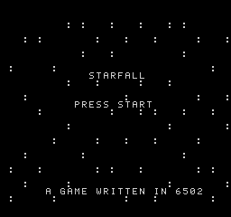
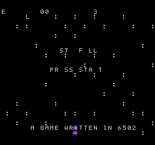
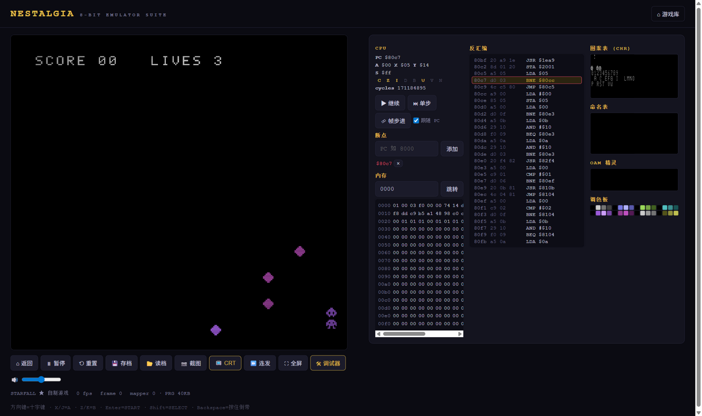
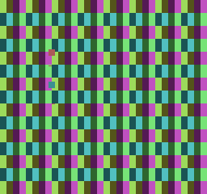

# NEStalgia

[**中文**](README.md) · **English**

   


[](https://cn718-xcp.github.io/NEStalgia/)

> **A complete NES (Famicom) emulator suite written from scratch** — zero third-party dependencies, pure JavaScript / Node standard library.
>
> A 6502 CPU (certified against the Klaus Dormann functional tests, the industry gold standard) · dot-accurate 2C02 PPU rendering · 2A03 APU synthesis ·
> 9 cartridge mappers · an in-house 6502 assembler · *STARFALL*, a homebrew 6502 assembly game · a hardware-grade debugger in the browser.


---

## What is this

NEStalgia is not "yet another web app" — it is a **1993 home console, precisely rebuilt in software**:

| Subsystem | What's implemented |
|---|---|
| **CPU** (`src/core/cpu.mjs`) | MOS 6502: all 151 official instructions + stable undocumented opcodes (SLO/RLA/SRE/RRA/SAX/LAX/DCP/ISB/ANC/ALR/ARR/SBX) + approximations for the unstable ones, page-cross cycle penalties, the `JMP ($xxFF)` page-wrap bug, edge-triggered NMI/IRQ injection, BCD (for the functional test; disabled on NES) |
| **PPU** (`src/core/ppu.mjs`) | Dot-accurate timing (341×262), loopy v/t/x/w scroll registers, background fetch pipeline (NT/AT/two bitplanes, 8-dot phases), sprite evaluation (8-sprite limit, 8×16, flipping, priority, sprite-0 hit), palette-mirroring quirks, 4 mirroring modes, programmatic NTSC palette |
| **APU** (`src/core/apu.mjs`) | Two pulses (duty/envelope/sweep/length counter), triangle (linear counter), noise (15-bit LFSR), DMC (samples fetched over the bus), 4/5-step frame sequencer with frame IRQ, NESdev mixing formula, ~47 kHz output |
| **Cartridge** (`src/core/cart.mjs`) | iNES parsing (with NES 2.0 detection), mappers **0 / 1 / 2 / 3 / 4 (MMC3 + scanline IRQ) / 7 / 11 / 34 / 66** (~85% of the licensed library), battery-backed PRG-RAM, CHR-RAM |
| **Console** (`src/core/console.mjs`) | Bus arbitration, PPU:CPU 3:1 dot timing, OAM DMA (513-cycle stall), controller shift registers, deterministic full-console snapshots |
| **Assembler** (`src/lib/asm.mjs`) | Two-pass, expression evaluator (`<` `>` low/high byte, `<<` `>>`, bitwise ops), forward references, opcode table derived directly from the CPU core (can never drift), iNES builder |
| **Homebrew game** (`tools/game.mjs`) | *STARFALL* — a complete 6502 assembly game: NMI main loop, LFSR randomness, collision/invincibility frames/scoring, APU sound effects. Assembled by the in-house assembler, running on this emulator |
| **Web frontend** (`public/`) | Game library (IndexedDB), 60.1 Hz frame stepping, AudioWorklet audio, Gamepad API, instant save/load states, **hold Backspace to rewind**, CRT filter, screenshot export, **WebM recording (video + audio)** |
| **Assembly playground** (`public/js/playground.mjs`) | Write 6502 assembly in the browser → the in-house assembler compiles it on the spot → the emulator runs it instantly; three built-in demos (HELLO / BOUNCE / INPUT) double as headless pipeline tests |
| **Debugger** (`public/js/debugger.mjs`) | Live disassembly (click a line to toggle a breakpoint), **RAM write watchpoints** (hits show address/value/PC), CPU registers/flags, hex memory viewer, pattern-table/nametable/OAM/palette visualization, single-step/frame-step |

**~7,100 lines of code (~5,300 product + ~1,800 tests). npm dependencies: 0.**

---

## Quick start

```bash
# No npm install needed — zero dependencies
node scripts/server.mjs
# Open http://localhost:8612
```

- The built-in homebrew game *STARFALL* is one click away
- Drag your own `.nes` files (mappers 0/1/2/3/4/7/11/34/66) onto the page to load them
- Controls: **Arrow keys**=D-pad · **X/J**=A · **Z/K**=B · **Enter**=START · **Shift**=SELECT · **hold Backspace**=rewind · **P**=pause

### Tests

```bash
node scripts/run-tests.mjs     # 135 unit/integration tests
node scripts/bench.mjs         # benchmark (~430 fps headless, 7x realtime)
node scripts/klaus.mjs         # Klaus Dormann 6502 functional tests (needs tmp/klaus.bin, see the script header)
node tools/build-roms.mjs      # rebuild roms/ and docs/screenshots/
```

Coverage: full instruction-set semantics with exact cycles, addressing-mode edge cases (zero-page wraparound, page-cross penalties), PPU register behavior with whole-frame pixel assertions, mapper banking semantics, APU length/envelope/frame-IRQ/DMC fetches, assembler encoding correctness, the homebrew game's full state machine (title → play → hurt → invincible → game over → back), and **deterministic whole-console snapshot replay** (replay after restore is pixel-identical to the original run).

---

## Screenshots

All genuine emulator output, generated by `node tools/build-roms.mjs`:

| | |
|---|---|
|  |  |
|  |  |

---

## Architecture

```
┌─────────────────────────  Browser  ──────────────────────────┐
│  Library (IndexedDB)   Player (60.1Hz rAF)   Debugger panel  │
│      │                    │                │                 │
│      │             AudioWorklet ←── 47kHz ring buffer        │
└──────┼────────────────────┼────────────────┼─────────────────┘
       │ fetch /core/*.mjs (ES Modules served as-is, no build)
┌──────▼────────────────────▼────────────────▼─────────────────┐
│                          Console                             │
│   ┌───────┐  3:1 dot timing ┌───────┐   frame seq. ┌───────┐ │
│   │ CPU   │◄────NMI/IRQ────►│  PPU  │             │  APU  │ │
│   │ 6502  │                 │ 2C02  │             │ 2A03  │ │
│   └───┬───┘                 └───────┘             └───────┘ │
│       │   bus: 2KB RAM / controllers / OAM DMA / $4014       │
│       └───────────────────┬─────────────────────────────────┘
│                 ┌─────────▼─────────┐
│                 │     Cartridge     │ iNES + mappers 0/1/2/3/4/7/11/34/66
│                 └───────────────────┘ + battery SRAM
└───────────────────────────────────────────────────────────────┘
```

### Layout

```
src/core/    cpu / ppu / apu / cart / console — pure logic, runs in browser and Node alike
src/lib/     asm.mjs assembler · disasm.mjs disassembler · demos.mjs demo programs · font.mjs font (shared by frontend, tools & tests)
tools/       game.mjs homebrew game source · testroms.mjs test-ROM generator · build-roms.mjs build script
public/      Web frontend (index.html + vanilla ES Modules, no build step)
tests/       10 test files, 135 assertions (custom sequential runner; sidesteps node --test hangs)
scripts/     server.mjs static server · run-tests.mjs · bench.mjs · klaus.mjs · png.mjs (zero-dependency PNG encoder)
roms/        starfall.nes — the homebrew game ROM (could, in theory, run on real hardware)
docs/        DEMO.md demo script · github-competitive-research.md landscape survey · screenshots/ all genuine emulator output
```

---

## Correctness verification

1. **Klaus Dormann 6502 functional tests** — the industry gold standard: official + undocumented instructions, every addressing mode, BCD arithmetic.
   NEStalgia's CPU passes all 30M+ instructions in ~0.7 s (`node scripts/klaus.mjs`).
2. **Pixel-level assertions** — test ROMs (assembled with the in-house assembler) render headlessly; tests assert exact palette indices on the framebuffer —
   covering all four background palettes, sprite flipping (H/V), 8×16 sprite bank selection, and the full sprite-0 hit loop (PPU flag → 6502 branch → RAM marker).
3. **Deterministic snapshots** — snapshot at any instant → restore into a second "console" → keep running → pixel-identical to the original
   (this is what makes save states and rewind trustworthy).
4. **Browser E2E** — verified in a real browser: 60 fps, keyboard play (pixel-exact positions), breakpoint hits, save/load round-trips, zero audio underruns.

## Known limitations

- Mappers 0/1/2/3/4/7/11/34/66 (~85% of the library) — SMB, SMB3, Contra, DuckTales and Zelda-class classics all run; MMC3 A12 detection is approximated once per scanline
- MMC1's PRG-RAM disable bit is ignored (WRAM is always readable/writable); MMC3's fixed-bank layout requires code in the last two 8K banks
- DMC sample playback does not emulate the CPU stall during fetches (pitch/length are correct; a few timing-sensitive games may be affected)
- The PPU is dot-accurate but not "cycle-by-cycle pixel output" grade (the sprite-overflow hardware quirk is not emulated)
- No PAL/region detection; the frame rate is fixed at NTSC 60.0988 Hz

## License

MIT (see [LICENSE](LICENSE)). The repository contains no copyrighted ROMs — `roms/` ships only the homebrew game *STARFALL*.
The Klaus Dormann functional-test binary follows its upstream license, is used for local verification only, and is not committed.
