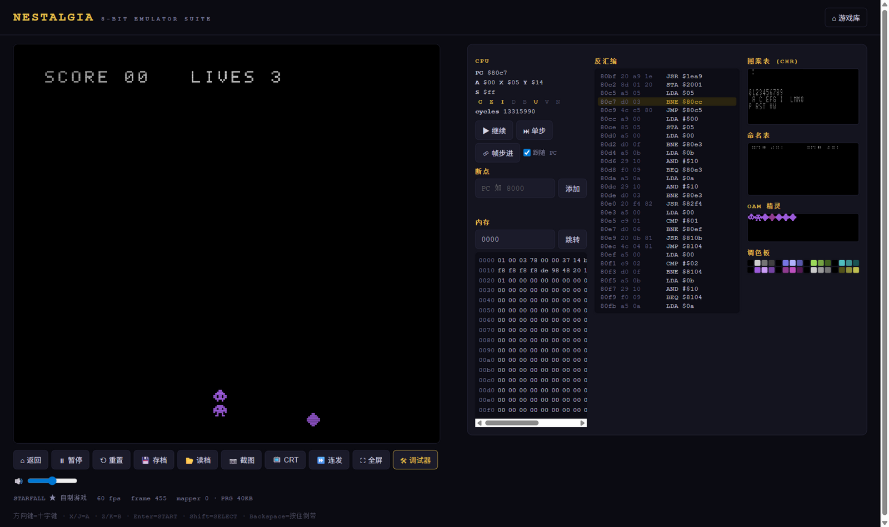

# NEStalgia

> **从零编写的 NES（FC）模拟器完整套件** — 零第三方依赖，纯 JavaScript / Node 标准库。
>
> 6502 CPU（通过 Klaus Dormann 功能测试金标准认证）· 2C02 PPU 逐点渲染管线 · 2A03 APU 音频合成 ·
> 5 种卡带 Mapper · 自研 6502 汇编器 · 自制 6502 汇编游戏《STARFALL》 · 硬件级调试器 Web 前端。



---

## 这是什么

NEStalgia 不是"又一个 Web 应用"——它是一台**用软件精确重建的 1993 年家用游戏机**：

| 子系统 | 实现内容 |
|---|---|
| **CPU** (`src/core/cpu.mjs`) | MOS 6502 全部 151 条官方指令 + 稳定非法指令（SLO/RLA/SRE/RRA/SAX/LAX/DCP/ISB/ANC/ALR/ARR/SBX）+ 不稳定 opcode 近似，页跨越周期惩罚、`JMP ($xxFF)` 页环绕 bug、NMI/IRQ 边沿注入、BCD（功能测试用，NES 上禁用） |
| **PPU** (`src/core/ppu.mjs`) | 逐点时序（341×262）、loopy v/t/x/w 滚动寄存器、背景取指流水线（NT/AT/双位面 8 点相位）、精灵求值（8 精灵限制、8×16、翻转、优先级、sprite-0 命中）、调色板镜像怪癖、4 种镜像模式、程序化 NTSC 调色板 |
| **APU** (`src/core/apu.mjs`) | 双脉冲（占空比/包络/滑音/长度计数器）、三角波（线性计数器）、噪声（15 位 LFSR）、DMC 增量调制（经总线取样本）、4/5 步帧序列器与帧 IRQ、NESdev 混音公式，~47kHz 输出 |
| **卡带** (`src/core/cart.mjs`) | iNES 解析（含 NES 2.0 检测）、Mapper **0 (NROM) / 1 (MMC1) / 2 (UxROM) / 3 (CNROM) / 7 (AxROM)**、电池存档 PRG-RAM、CHR-RAM |
| **主机** (`src/core/console.mjs`) | 总线仲裁、PPU:CPU 3:1 点时序、OAM DMA（513 周期停顿）、手柄移位寄存器、整机确定性存档 |
| **汇编器** (`tools/asm.mjs`) | 两遍扫描、表达式求值器（`<` `>` 取低/高字节、`<<` `>>`、位运算）、正向引用、编码表直接派生自 CPU 核心（永不失配）、iNES 构建器 |
| **自制游戏** (`tools/game.mjs`) | 《STARFALL》——完整 6502 汇编游戏：NMI 主循环、LFSR 随机数、碰撞/无敌帧/计分、APU 音效。由本汇编器汇编，在本模拟器上运行 |
| **Web 前端** (`public/`) | 游戏库（IndexedDB）、60.1Hz 帧步进、AudioWorklet 音频、手柄 API、即时存档/读档、**按住 Backspace 倒带**、CRT 滤镜、截图导出 |
| **调试器** (`public/js/debugger.mjs`) | 实时反汇编（点击行设断点）、CPU 寄存器/标志、内存十六进制查看、图案表/命名表/OAM/调色板可视化、单步/帧步进 |

**代码量约 9,000 行，npm 依赖：0 个。**

---

## 快速开始

```bash
# 无需 npm install —— 零依赖
node scripts/server.mjs
# 打开 http://localhost:8612
```

- 内置自制游戏《STARFALL》，点卡片即玩
- 把你自己的 `.nes` 文件（支持 mapper 0/1/2/3/7）拖进页面即可加载
- 键位：**方向键**=十字键 · **X/J**=A · **Z/K**=B · **Enter**=START · **Shift**=SELECT · **Backspace 按住**=倒带 · **P**=暂停

### 测试

```bash
node scripts/run-tests.mjs     # 98 项单元/集成测试
node scripts/klaus.mjs         # Klaus Dormann 6502 功能测试（需 tmp/klaus.bin，见脚本头注释）
node tools/build-roms.mjs      # 重新构建 roms/ 与 docs/screenshots/
```

测试覆盖：CPU 全指令集语义与精确周期、寻址模式边界（零页环绕、跨页惩罚）、PPU 寄存器行为与整帧像素断言、
Mapper 切换语义、APU 长度/包络/帧 IRQ/DMC 取数、汇编器编码正确性、自制游戏全状态机（标题→游戏→受伤→无敌→
游戏结束→返回）、以及 **整机存档确定性重放**（快照后重放与原运行逐像素一致）。

---

## 架构

```
┌────────────────────────  浏览器  ────────────────────────┐
│  游戏库(IndexedDB)   播放器(60.1Hz rAF)   调试器面板        │
│      │                  │            │                   │
│      │            AudioWorklet ←─ 47kHz 环形缓冲           │
└──────┼──────────────────┼────────────┼───────────────────┘
       │ fetch /core/*.mjs（ES Modules 直出，无构建步骤）
┌──────▼──────────────────▼────────────▼───────────────────┐
│                    Console（主机）                        │
│   ┌───────┐ 3:1 点时序  ┌───────┐   帧序列器  ┌───────┐   │
│   │ CPU   │◄──NMI/IRQ──►│  PPU  │            │  APU  │   │
│   │ 6502  │             │ 2C02  │            │ 2A03  │   │
│   └───┬───┘             └───┬───┘            └───────┘   │
│       │      总线: RAM 2KB / 手柄 / OAM DMA / $4014        │
│       └──────────────┬────────────────────────────────────┘
│                ┌─────▼─────┐
│                │ Cartridge │  iNES + Mapper 0/1/2/3/7 + 电池 SRAM
│                └───────────┘
└──────────────────────────────────────────────────────────┘
```

### 目录

```
src/core/    cpu / ppu / apu / cart / console —— 纯逻辑，浏览器与 Node 通用
src/lib/     disasm.mjs —— 反汇编器（调试器与测试共用）
tools/       asm.mjs 汇编器 · game.mjs 自制游戏 · testroms.mjs 测试 ROM · build-roms.mjs 构建脚本
public/      Web 前端（index.html + 原生 ES Modules）
tests/       7 个测试文件，98 项断言（自研顺序执行器，规避 node --test 挂起问题）
scripts/     server.mjs 静态服务器 · run-tests.mjs · klaus.mjs · png.mjs（零依赖 PNG 编码器）
roms/        starfall.nes —— 可在真机硬件上运行的自制游戏 ROM（理论上）
docs/        DEMO.md 演示手册 · screenshots/ 全部为真实模拟输出
```

---

## 正确性验证

1. **Klaus Dormann 6502 功能测试**：业界金标准，官方+非法指令、全部寻址模式、BCD 运算。
   NEStalgia CPU 在约 0.7 秒内完整通过 3000 万+ 条指令（`node scripts/klaus.mjs`）。
2. **像素级断言**：测试 ROM（用自研汇编器汇编）在无头模式下渲染，断言 framebuffer 上的精确调色板索引——
   覆盖背景四调色板、精灵翻转（水平/垂直）、8×16 精灵 bank 选择、sprite-0 命中闭环（PPU 标志 → 6502
   分支 → RAM 标记）。
3. **确定性存档**：任意时刻快照 → 恢复到第二台"主机" → 继续运行 → 与原机逐像素一致（save states 与
   倒带功能因此可靠）。
4. **浏览器 E2E**：真实浏览器实测 60fps 运行、键盘操控（位置精确到像素）、断点命中、存档往返、音频零欠载。

## 已知限制

- Mapper 覆盖 0/1/2/3/7（约占 NES 游戏库 55%）——SMB、Contra、Duck Tales、Zelda 级别的经典卡带均可运行
- DMC 采样播放未模拟 CPU 取指停顿（音高/时长正确，极端时序敏感的少数游戏可能受影响）
- PPU 精确到点但非"cycle-by-cycle 像素输出"级别（sprite overflow bug 的硬件怪癖未模拟）
- 不支持 PAL/区域检测；帧率恒为 NTSC 60.0988Hz

## 许可

MIT。Klaus Dormann 功能测试二进制遵循其原仓库许可，仅用于本地验证、不入库。
