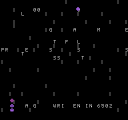
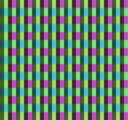

# NEStalgia 演示手册

全部截图均为**真实模拟器输出**（无头渲染或浏览器实拍），无任何手绘/PS。

---

## 演示一：自制游戏《STARFALL》

一款完整的 6502 汇编游戏——由本项目的汇编器 `tools/asm.mjs` 汇编，在本模拟器上运行。
没有游戏引擎、没有现成库：标题画面、状态机、碰撞、计分、音效，全部是手写 6502 机器码。

### 标题画面

- 星空背景 + 手写 5×7 像素字库（每个字形 7 字节，共 26 个字母数字）
- 按 START 进入游戏

### 游戏中

- 顶部 HUD：`SCORE 00` / `LIVES 3`——由 NMI 中断在垂直消隐期直接写命名表（真实的 FC 编程技法）
- 操作：方向键左右移动飞船；**接住亮星 +1 分，躲开暗星**（扣一条命 + 30 帧无敌闪烁）
- 难度递增：星星下落速度随分数提升，生成间隔缩短
- 音效：接住 = 脉冲波 beep；受伤 = 噪声通道爆破（双通道由 6502 直接写 APU 寄存器）

### 游戏结束

- 命尽后显示 GAME OVER，按 START 回到标题

> **验证**：`node scripts/run-tests.mjs` 中 7 项游戏集成测试覆盖了全部状态迁移、
> 碰撞命中、无敌帧窗口、HUD 数字渲染——甚至包括"边沿检测防止长按 START 跳过画面"这类细节。

---

## 演示二：测试场景（硬件验证用）

### 颜色条

四组背景调色板 × 两种图案位面的条纹场景。无头测试断言屏幕上 5 个采样点的**精确调色板索引**，
一次验证：调色板 RAM 上传、属性表象限选择、图案表寻址、渲染管线时序。

### 精灵场景

OAM DMA（$4014）+ 水平/垂直翻转 + 精灵调色板选择 + 精灵与背景优先级的像素级验证。

---

## 演示三：浏览器实机运行 + 硬件调试器


左边：**正在运行的 STARFALL**（60fps，AudioWorklet 音频，CRT 滤镜开启）。
右边：**硬件调试器**，全部面板实时数据：

1. **CPU 面板**：PC/A/X/Y/S/标志位/周期计数。注意内存查看器第一行
   `01 00 03 78`——正是游戏的零页变量 `state=1, score=0, lives=3, playerX=$78(120)`。
2. **反汇编**：跟随 PC 逐条解码，**点击任意行设断点**，命中自动暂停（红色高亮）。
   图中断点 `$80c7` 命中，停在主循环的 `BNE $80cc` 上。
3. **内存查看器**：任意 CPU 总线地址十六进制转储。
4. **图案表 (CHR)**：两 bank × 256 tile 完整可视化——左上角能看到自制游戏的字库 tile。
5. **命名表**：两个命名表四分之一比例渲染（含属性表调色板）——截图中可见 HUD 文字。
6. **OAM 精灵**：64 个精灵条目的 tile 图案——飞船与星星清晰可见。
7. **调色板**：32 项背景/精灵调色板实时色块。

### 操作步骤（亲手试）

```bash
node scripts/server.mjs          # → http://localhost:8612
```

1. 点击《STARFALL》卡片 → 自动进入游戏（60fps，有声音）
2. 按 `Enter` 开始，方向键移动，接几颗亮星
3. 点 **🛠 调试器** → 反汇编任意行点击 → 设为断点 → 下一帧命中自动暂停
4. 点 **⏭ 单步** 逐指令执行，观察寄存器与周期计数
5. 按 **Backspace 按住** → 时间倒流（确定性存档环）
6. 点 **💾 存档** / **📂 读档** → 状态跨会话保存（IndexedDB）
7. 点 **📺 CRT** → 扫描线滤镜；**⏩ 连发** = 4 倍速；**📷 截图** 导出 PNG
8. 把任意 mapper 0/1/2/3/7 的 `.nes` 拖进页面 → 立即入库可玩

---

## 演示四：Klaus Dormann 6502 功能测试（金标准）

```bash
# 下载官方测试二进制（见 scripts/klaus.mjs 头部说明）后：
node scripts/klaus.mjs
# → KLAUS FUNCTIONAL TEST: PASS (reached success loop at $3469 after 30,646,176 instructions, 0.7s)
```

该测试覆盖全部 151 条官方指令 + 稳定非法指令、所有寻址模式、BCD 十进制运算、页跨越行为。
**通过 = CPU 核心获得业界公认的完整性认证。**

---

## 演示五：一行代码证明"零依赖"

```bash
$ grep -c '"' package.json   # package.json 中没有任何 dependencies 字段
$ node -e "console.log(require('module').builtinModules.filter(m=>['http','zlib','fs','path','url'].includes(m)))"
[ 'http', 'zlib', 'fs', 'path', 'url' ]   # 全部使用 Node 标准库
```

静态服务器（node:http）、PNG 编码器（node:zlib）、测试执行器、汇编器、模拟器——
从下到上没有引入一个第三方包。
